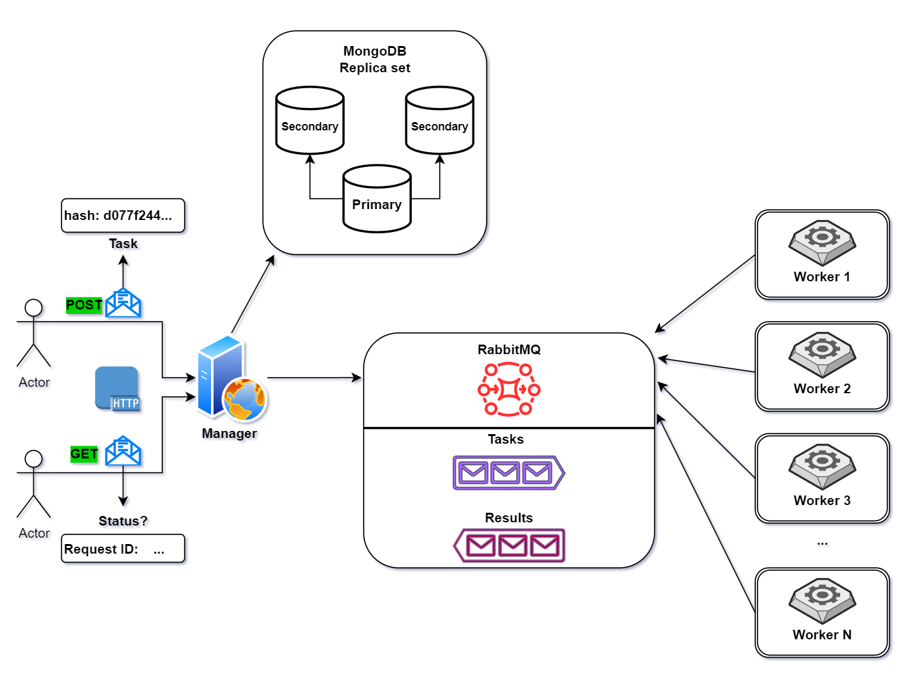

# Crack Hash

Распределенная отказоустойчивая система для декодирования md5 хэша.

В каждой задаче пространство паролей для перебора равномерно распределяется между воркерами.

# Архитектура приложения



# Запуск приложения

Необходимо создать файл ```.env``` в корне проекта
и внести конфигурационную информацию.

В проекте есть пример в файле ```.env.example```

---

Компиляция и запуск приложения:

```bash
$ ./mvnw clean package
$ docker compose up --build -d 
```

---

По адрессу ```http://localhost:{your_port}/swagger-ui``` доступно API приложения, автоматически сгенерированное через OpenAPI


Порт зависит от конфигурации в ```.env```

---

# Примеры запросов

(есть в ```manager/.../resources/requests```)

**Запрос на выполнение задачи**

```http request
POST http://localhost:8090/api/hash/crack
Accept: application/json
Content-Type: application/json

{
    "hash":"d077f244def8a70e5ea758bd8352fcd8",
    "maxLength": 4
}
```
**Получить статус выполнения задачи**
```http request
GET http://localhost:8090/api/hash/status?requestId=7717ecf9-282a-4c40-af0b-44ade78b44ec
Accept: application/json
```
